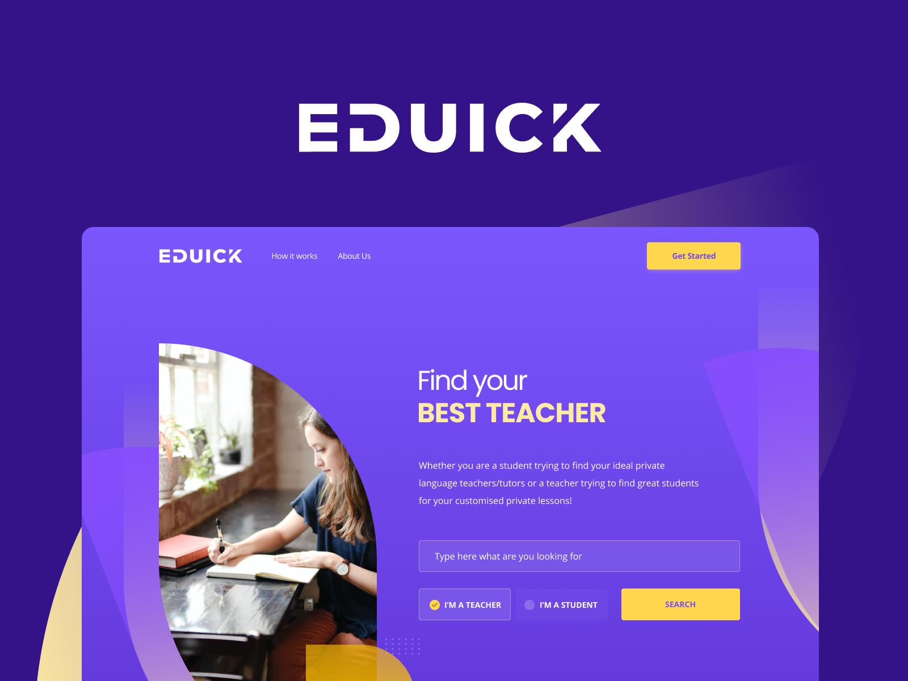

## Sobre o desafio

Desafio com a finalidade de testar os conhecimentos para a vaga de Frontend na EduSynch

## Tecnologias e ferramentas utilizadas

- Next.js versão 12
- React 17.x
- React-dom 17.x

## Páginas desenvolvidas

- Landing page

- Dashboard

## Testes

Não implementados.

## Execução do projeto

Para executar o projeto (modo desenvolvedor):

1. Baixar o projeto em: `https://github.com/ronynogueiras/eduick`
2. Navegue até a pasta do projeto: `cd eduick`
3. Instale as dependências do projeto: `yarn install`
4. Executar em modo de desenvolvimento: `yarn dev`
5. Abrir o projeto local: `http://localhost:3000`

Para compilar o projeto (produção):

1. Baixar o projeto em: `https://github.com/ronynogueiras/eduick`
2. Navegue até a pasta do projeto: `cd eduick`
3. Instale as dependências do projeto: `yarn install`
4. Executar em modo de desenvolvimento: `yarn build`
5. Abrir o projeto local: `http://localhost:3000`
